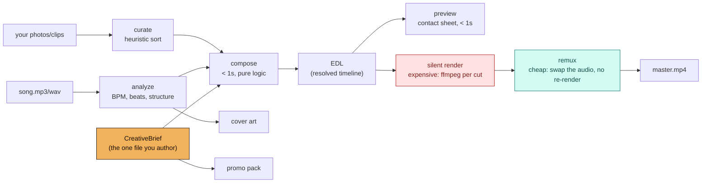

<h1 align="center">kaleidophone</h1>

<p align="center">
  <strong>Compose the edit, not the pixels.</strong><br>
  A song + your photos -> a beat-synced, station-graded, loopish music video.
  Plus the cover art and the promo pack, from the same source of truth.
</p>

<p align="center">
  <a href="https://github.com/sep-lab/kaleidophone/actions/workflows/ci.yml"></a>
  <a href="https://pypi.org/project/kaleidophone/"></a>
  <a href="LICENSE"></a>
  
  <a href="CONTRIBUTING.md"></a>
</p>

<p align="center">
  <a href="#see-it-in-ten-seconds">Quick start</a> ·
  <a href="#the-idea">The idea</a> ·
  <a href="#the-workflow-this-is-built-around">Draft -> confirm -> final</a> ·
  <a href="#the-vibe">The vibe</a> ·
  <a href="#cost-measured">Cost, measured</a> ·
  <a href="#documentation">Docs</a> ·
  <a href="#where-to-start-contributing">Contribute</a>
</p>

---

## What this is

You have a song and a folder of photos (and maybe some clips). You want a
music video that cuts on the beat, looks like something — not a slideshow
with a Ken Burns pan — and doesn't take an afternoon of manual editing or a
GPU farm. kaleidophone turns that into three things from one source file:

- a **video**, cut on the beat, color-graded per section, in a deliberately
  vintage/psychedelic/loopish default look (not an option you have to
  discover — the starting point);
- **cover art**, generated straight from the song's own energy envelope,
  in the same station's palette as the video;
- a **promo pack** — chapters, a caption draft, a teaser cadence, a
  suggested pinned comment — as markdown, ready to paste into a release.

The source file is a `CreativeBrief`: one small, readable, diffable YAML
document. Everything else — the edit-decision-list, the rendered video, the
teasers, the thumbnails, the cover — is derived from it and rebuildable.
That's not an implementation detail, it's the whole architecture; see
[**the idea**](#the-idea) below.

kaleidophone shells out to a real `ffmpeg` for every pixel; there is no
per-frame AI generation in the render path (why, below). It runs
comfortably on a laptop, and the default output is 1280x720, not 4K —
this project's whole premise is token/compute efficiency and a fast
iteration loop over maximum resolution.

## See it in ten seconds

No real media required, nothing to connect, nothing to ask permission for:

```bash
pip install kaleidophone            # needs a system ffmpeg on PATH — see below
```

or from a checkout:

```bash
git clone https://github.com/sep-lab/kaleidophone && cd kaleidophone
pip install -e ".[dev]"
bash examples/demo/run_demo.sh
```

This generates a synthetic song and synthetic placeholder photos (procedural
gradients — nothing real, nothing personal, see
`examples/demo/generate_fixtures.py`), then runs the real pipeline —
analyze, curate, compose, preview, render, cover, promo — against them.
**Measured, one data point, not a benchmark suite** (machine below):
18.1 seconds, end to end, for a 24-second/37-cut video at 640x360.

Needs a system `ffmpeg` on `PATH` (`brew install ffmpeg` / `apt install
ffmpeg`) — kaleidophone renders through the real binary rather than a Python
video dependency; see
[ADR-0002](docs/decisions/0002-deterministic-edit-engine.md).

**Then try it on your own song and photos** (never commit either — see
[AGENTS.md](AGENTS.md)):

```bash
kaleidophone auto ~/Music/your_song.mp3 ~/Pictures/some_folder -o /tmp/kaleidophone_out --preview-only
open /tmp/kaleidophone_out/preview_contact_sheet.jpg      # sanity-check the edit, no render yet
kaleidophone run /tmp/kaleidophone_out/generated_brief.yaml -o /tmp/kaleidophone_out   # render for real
```

Zero config required — `kaleidophone auto` writes out the brief it generated
(`generated_brief.yaml`) as a normal, fully-editable file, so "now
customize it" is a text edit and a re-run, not a different tool. See
[**two ways to start**](#two-ways-to-start) below.

## The idea

**kaleidophone versions the creative brief, not the render.** A `CreativeBrief` —
song, stations (color-grade "looks"), sections (structure + effects),
output settings — is the one file a person authors or edits by hand. The
edit-decision-list, the silent video, the muxed master, the teasers, the
thumbnails, the cover art: all derived, all rebuildable, none of them the
source of truth. See
[ADR-0001](docs/decisions/0001-version-the-brief-not-the-render.md) for the
full reasoning — it's the decision everything else in this repo follows
from, the same way its sibling project
[Wit](https://github.com/sep-lab/Wit) versions the *recipe* of a DAW
session rather than its bounced audio.



The practical payoff is the workflow below.

## The workflow this is built around

The thing this project was explicitly built to support: **upload a draft
mp3, get a full video back, confirm the edit, then swap in the mastered
wave — without re-rendering the video.**

```bash
kaleidophone silent edl.json brief.yaml -o silent.mp4     # expensive: one+ ffmpeg call per cut
kaleidophone remux   silent.mp4 mastered_song.wav -o master.mp4   # cheap: audio swap only, no re-render
```

`render_silent()` is the only step that touches every cut's color grade and
effects; `mux_audio()` is one ffmpeg stream-copy on the video side plus one
audio re-encode. **Measured on this repo's own demo (37 cuts, 24s):**

| Resolution | `silent` | `remux` | speedup |
|---|---|---|---|
| 640x360 | 10.7s | 1.0s | ~11x |
| 1280x720 | 22.6s | 1.1s | ~21x |

(Both `remux` figures include ~0.8s of Python interpreter and librosa import
startup, which is most of what they measure — the ffmpeg work itself is a
fraction of a second. That startup cost is why the speedup here looks smaller
than the underlying ffmpeg ratio.)

The speedup isn't a fixed constant — `remux` barely moves with resolution
(it's not re-encoding video), while `silent` scales with pixel count, so
the gap widens the higher you render. Either way: approve the edit once,
then iterate on the audio (a rough mix -> a mastered file -> a radio edit)
in about a second each time, near-independent of resolution. See
[ADR-0001](docs/decisions/0001-version-the-brief-not-the-render.md) and the
`kaleidophone-render` skill.

`kaleidophone render` (or `kaleidophone run`'s full pipeline) does both steps in one
call and cleans up the intermediate — use that instead when you don't
expect to touch the audio again.

## Two ways to start

**Zero config.** Point `kaleidophone auto` at a song and a folder of mixed
photos/clips; it analyzes the song, proposes section boundaries from real
structural signals (a quiet passage, a sudden jump in energy), curates the
folder against a small built-in station palette, and writes out a complete,
editable brief plus a contact-sheet preview — no manual authoring required.
See [ADR-0004](docs/decisions/0004-default-mode-and-auto-curation.md).

**Hand-authored.** Write the YAML directly — `docs/CONFIG-SCHEMA.md` is the
full field reference, `examples/love/brief.yaml` is a fully-worked
structural template (see [the case study](docs/case-studies/love.md) it
comes from). Use this when you can hear a structure the auto-sectioner
won't reliably find, or want full control over which station gets which
section.

Both paths produce the exact same kind of file — `kaleidophone auto`'s output is
a completely normal brief the moment it's written. There's no separate
"simple mode" format to graduate out of.

## The vibe

The look isn't a preset you opt into — it's the default, because that's
the aesthetic this framework was built to produce fast: vintage, grainy,
a little psychedelic, loopish, radio-static energy. Structure comes from
**stations** — named color-grade "looks" any brief can point at its own
media:

| Station | Feel | Typically used for |
|---|---|---|
| `amber-room` | warm interiors, lamplight, intimate | an intro, a home-recorded feeling |
| `noir-crush` | black & white, crushed blacks, scanlines | street/documentary energy |
| `gold-hour` | golden hour, backlit, slow | a song's quiet or held moment |
| `fire-leak` | boosted color, hot light-leak energy | the loudest, most saturated stretch |

Effects layer on top per section — `strobe`, `kaleidoscope`, `halation`,
`freeze_on_peak`, `zoom_breathe`, `grain`, `scanlines`, and more — several
of them conditional on the song's own structure (`strobe` only fires on
cuts containing a real onset, not every cut in a section). Full vocabulary
and the "two rooms, one frequency" AM/FM concept these presets generalize
from: [docs/CREATIVE-GUIDE.md](docs/CREATIVE-GUIDE.md) and
[docs/case-studies/love.md](docs/case-studies/love.md) — a real ~11-minute
project this framework was extracted from (identifying details scrubbed;
structure, timestamps, and station design are real).

## Cost, measured

One data point, on one machine, from `examples/demo/`'s synthetic
24s/37-cut fixture — not a benchmark suite. Reproduce these yourself: see
[CONTRIBUTING.md](CONTRIBUTING.md), "Ground rules for claims".

**Measured on:** Apple M1 Pro (10 cores), macOS 15.7, ffmpeg 7.1, CPython
3.11.10 — note that this is an *x86_64* Python running under Rosetta 2, not a
native arm64 build, so a native run should be faster. Stated because "one
machine" is only useful if you know which.

| | Resolution | Time | Size |
|---|---|---|---|
| Full `kaleidophone run` | 640x360 | 18.1s | 27.0 MB |
| Full `kaleidophone auto` (42 photos, 5 sections) | 1280x720 | 39.4s | 182.3 MB |
| `silent` render alone | 640x360 -> 1280x720 | 10.7s -> 22.6s | 26.7 MB -> 104.9 MB |
| `remux` alone (either resolution) | — | ~1.0s | — |

Grain and noise-heavy effects resist h264 compression, which is a real
tradeoff between the vintage look this project defaults to and output file
size — not a bug. Turn down `StationConfig.grain` if size matters more than
texture for a given project. Full breakdown, including *why* the render
pipeline is segment-then-concat rather than one giant filter graph:
[docs/ARCHITECTURE.md](docs/ARCHITECTURE.md).

Also measured: beat detection on the demo's synthetic click track
(programmed at exactly 120.0 BPM) comes back **117.5** — a real reminder
that tempo tracking is a heuristic first pass, overridable via
`SongConfig.bpm`, not a promise of exact detection even on a clean signal.
On that same track librosa returns **no beats at all** for the first 11
seconds (a quiet intro and a near-silent hush); sections with no detected
beats fall back to the tempo grid and say so on stderr, rather than
silently collapsing into one long static shot. See
[docs/ARCHITECTURE.md](docs/ARCHITECTURE.md), "Frame-accurate cuts".

## Demos

Every push builds the demo on real ffmpeg and uploads the actual output —
`master.mp4`, `cover.jpg`, the contact sheet, the promo pack — as a CI
artifact you can download:
[latest CI runs](https://github.com/sep-lab/kaleidophone/actions/workflows/ci.yml)
→ any green run → **Artifacts** → `demo-output-ubuntu-latest`.

That output is entirely synthetic (procedural gradients and a generated
click track), because no real photo, video, or audio is ever committed here
— see [ADR-0003](docs/decisions/0003-public-framework-private-assets.md). A
hosted demo built from a real project is on
[the roadmap](docs/ROADMAP.md), Phase 4, and will be linked here when there
is one worth showing.

## Why ffmpeg, not AI video generation

Real photos and clips, assembled deterministically — not a per-frame
generative model. Three reasons, in order: cost (per-frame generation for a
multi-minute video is expensive and slow; ffmpeg filter graphs on real
media are neither), reproducibility (the same brief renders the same video
every time — a property `kaleidophone silent`/`kaleidophone remux`'s whole cheap-resync
workflow depends on), and creative control (a station's color grade is a
handful of legible numbers, not a prompt you reverse-engineer until it
looks right). AI-assisted *extensions* — cover art, captions — are a
documented, opt-in, not-yet-built roadmap item that plugs into the same
pipeline rather than replacing it; see
[ADR-0002](docs/decisions/0002-deterministic-edit-engine.md) and
[docs/ROADMAP.md](docs/ROADMAP.md).

## Your media stays yours

kaleidophone is local-first and never transmits your photos, video, or audio
anywhere — everything runs on your own machine through your own `ffmpeg`.
This repository itself is built so that **no real media and no personal
file path can be committed to it**, enforced in CI, not just by
convention:

- `.gitignore` blocklists every common audio/video/image extension.
- `check_no_media.sh` refuses them again at commit time, plus an
  oversized-file ceiling for formats nobody thought to blocklist yet.
- `check_no_personal_paths.py` refuses absolute paths into a real home
  directory (`/Users/you/...`, `/home/you/...`) anywhere in a tracked file.
- Every example brief in this repo ships placeholder paths
  (`/path/to/your/photos/...`) and an empty `promo.handles: []` —
  never a real folder, never a real collaborator.

See [ADR-0003](docs/decisions/0003-public-framework-private-assets.md),
[AGENTS.md](AGENTS.md), and [SECURITY.md](SECURITY.md).

## Repo map

```
src/kaleidophone/
  audio/        analyze a song -> BPM, beats, structure, wave map
  assets/       station presets + heuristic photo/clip curation
  timeline/     CreativeBrief schema, EDL, compose(), zero-config auto mode
  render/       ffmpeg pipeline (silent/remux split, effects, preview, teasers)
  cover/        procedural cover art from the song's own energy envelope
  promo/        chapters, caption draft, teaser cadence, pinned-comment suggestion
  cli.py        the `kaleidophone` command
skills/         one SKILL.md per pipeline stage — for agents and people alike
examples/
  demo/         fully synthetic end-to-end demo (run_demo.sh)
  love/         a hand-authored brief matching a real reference project
docs/
  decisions/    ADRs — the design, and what would overturn each one
  case-studies/ the real project this framework generalizes from
tests/          unit tests; tests/factories/ builds every fixture from
                numbers -- no real media, no audio decode, no ffmpeg call.
                The ffmpeg-facing modules are covered by asserting on the
                argv they build, not by running it.
.github/workflows/  CI: lint, tests, the privacy guardrails, and a real
                     ffmpeg run of the demo on every push
```

## Documentation

- **[AGENTS.md](AGENTS.md)** — the canonical brief for anyone (or any
  agent) working on this repo. Start here if you're contributing code.
- **[docs/ARCHITECTURE.md](docs/ARCHITECTURE.md)** — the pipeline in
  detail, the measured cost table, and the render-design tradeoffs.
- **[docs/decisions/](docs/decisions/)** — five ADRs, all accepted. Read
  [0001](docs/decisions/0001-version-the-brief-not-the-render.md) and
  [0002](docs/decisions/0002-deterministic-edit-engine.md) first.
- **[docs/CREATIVE-GUIDE.md](docs/CREATIVE-GUIDE.md)** — the visual/sonic
  vocabulary: stations, effects, structure.
- **[docs/CONFIG-SCHEMA.md](docs/CONFIG-SCHEMA.md)** — full `CreativeBrief`
  field reference.
- **[docs/ROADMAP.md](docs/ROADMAP.md)** — what's next, including the
  opt-in AI-assisted cover-art/caption extension points.
- **[docs/PRIOR-ART.md](docs/PRIOR-ART.md)** — what else already does this,
  what those tools do better, and the risks to this one's premise.
- **[docs/case-studies/love.md](docs/case-studies/love.md)** — the real
  project this framework was extracted from.

## Status

**v0.1, working end to end** — not a design sketch. Every claim above was
measured by actually running the pipeline on the machine named in
[Cost, measured](#cost-measured) (see [CHANGELOG.md](CHANGELOG.md) for
what's built, including the real bugs found and fixed rather than documented
as known issues). What's genuinely still open:

- **Proven on one real project so far.** `docs/case-studies/love.md` is a
  scrubbed reconstruction of the project this framework generalizes from —
  real structure, real timestamps, real station design, but one project.
  A second, independently-run case study would do more to prove this
  generalizes than anything else on the roadmap; see
  [CONTRIBUTING.md](CONTRIBUTING.md).
- **AI-assisted cover art and captions are designed for, not built.** The
  deterministic pipeline is the whole default today; see
  [docs/ROADMAP.md](docs/ROADMAP.md), Phase 3.

## Where to start contributing

Full guide: **[CONTRIBUTING.md](CONTRIBUTING.md)**. The short version:

| | Task |
|---|---|
| 🟢 | More effects — `render/effects.py` is small composable filter-string builders; a new one is a function plus a registry entry |
| 🟢 | A second worked case study — the single highest-value contribution on the roadmap |
| 🟡 | Better auto-curation — `assets/curation.py`'s heuristic scorer is a documented first pass ([ADR-0004](docs/decisions/0004-default-mode-and-auto-curation.md)) |
| 🟡 | Smarter auto-sectioning — `timeline/autobrief.py` currently falls back to even slicing more often than it should |
| 🔴 | Adversarial review of the privacy guardrails — if you can get a real path or a media file past CI, that's exactly the report this project wants |

## License

[Apache License 2.0](LICENSE) · [Code of Conduct](CODE_OF_CONDUCT.md) · [Security](SECURITY.md)
