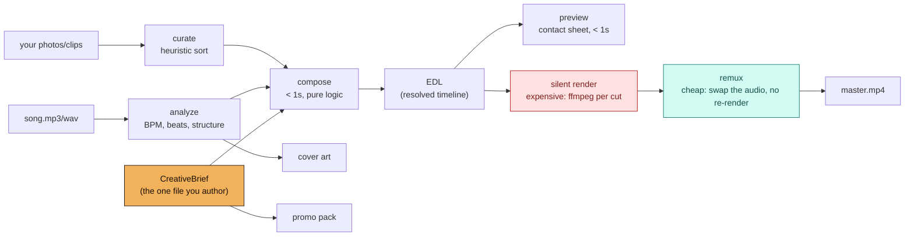

<h1 align="center">kaleidophone</h1>

<p align="center">
  <strong>Compose the edit, not the pixels.</strong><br>
  A song + your own photos and clips -> a beat-synced, station-graded music
  video, vertical cutdowns, cover art, and the per-platform release copy —
  all derived from one small YAML file you can read.
</p>

<p align="center">
  <em>Claude directs. ffmpeg draws every pixel. Nothing is generated into a frame.</em>
</p>

<p align="center">
  <a href="https://github.com/sep-lab/kaleidophone/actions/workflows/ci.yml"></a>
  <a href="https://pypi.org/project/kaleidophone/"></a>
  <a href="LICENSE"></a>
  
  <a href="CONTRIBUTING.md"></a>
</p>

<p align="center">
  <a href="#two-front-doors">Start here</a> ·
  <a href="#the-idea">The idea</a> ·
  <a href="#the-workflow-this-is-built-around">Draft -> confirm -> final</a> ·
  <a href="#the-vibe">The vibe</a> ·
  <a href="#made-with-this">Made with this</a> ·
  <a href="#cost-measured">Cost, measured</a> ·
  <a href="#documentation">Docs</a> ·
  <a href="#where-to-start-contributing">Contribute</a>
</p>

---

## What this is

You have a song and a folder of photos and clips. You want a music video that
cuts on the beat and looks like something — not a slideshow with a Ken Burns
pan — plus the vertical cutdown, the cover, and the caption you have to write
before you can post any of it.

kaleidophone turns that into a release from one source file:

- a **video**, cut on the beat, colour-graded per section, in a deliberately
  vintage/psychedelic/loopish default look — at 16:9, or composed **natively
  vertical** for a reel, with per-shot framing so the crop lands where the
  subject actually is;
- **timed text cards** burned into the picture — titles, lyric lines, credits —
  with real right-to-left shaping, so a bilingual card is not a workaround;
- **cover art**, generated from the song's own energy envelope, in the same
  station's palette as the video;
- a **release pack** — per-platform captions, chapters, timed comments, a
  pinned comment, a posting order — as markdown, with every timestamp derived
  from the edit rather than retyped.

The source file is a `CreativeBrief`: one small, readable, diffable YAML
document. Everything else — the edit-decision-list, the rendered video, the
teasers, the thumbnails, the cover, the copy — is derived from it and
rebuildable. That's not an implementation detail, it's the whole architecture;
see [**the idea**](#the-idea) below.

kaleidophone shells out to a real `ffmpeg` for every pixel; there is no
per-frame AI generation in the render path (why, below). It runs comfortably
on a laptop.

## Two front doors

### I make music

Install it as a Claude Code plugin and talk to it:

```
/plugin marketplace add sep-lab/kaleidophone
/plugin install kaleidophone@kaleidophone
```

Then, in the folder with your song and your photos:

```
/kaleido:direct song.wav ./photos
```

Claude analyses the track, tells you where the quiet passages and the energy
jumps actually are, asks you the two or three things the audio can't answer,
writes the brief, and shows you a contact sheet before anything expensive
happens. It is directing, not generating — every frame is your own material.

Other commands: `/kaleido:release` (the whole arc), `/kaleido:caption`,
`/kaleido:cover`, `/kaleido:brief`.

### I write code

```bash
pip install kaleidophone            # needs a system ffmpeg on PATH
```

```bash
kaleidophone auto song.wav ./photos -o out/ --aspect 9:16 --preview-only
```

That writes `out/generated_brief.yaml` — a completely normal, fully editable
brief — plus a contact sheet. Edit it, then `kaleidophone run` it for real.
`docs/CONFIG-SCHEMA.md` is the full field reference.

Or from a checkout, with nothing of your own required:

```bash
git clone https://github.com/sep-lab/kaleidophone && cd kaleidophone
pip install -e ".[dev]" && bash examples/demo/run_demo.sh
```

That generates a synthetic song and procedural placeholder images — nothing
real, nothing personal — then runs the real pipeline end to end.
**Measured, one data point, not a benchmark suite:** 18.1 seconds for a
24-second/37-cut video at 640x360, on the machine named in
[Cost, measured](#cost-measured).

Needs a system `ffmpeg` (`brew install ffmpeg` / `apt install ffmpeg`) — see
[ADR-0002](docs/decisions/0002-deterministic-edit-engine.md).

## The idea

**kaleidophone versions the creative brief, not the render.** A `CreativeBrief` —
song, stations (color-grade "looks"), sections (structure + effects),
output settings — is the one file a person authors or edits by hand. The
edit-decision-list, the silent video, the muxed master, the teasers, the
thumbnails, the cover art: all derived, all rebuildable, none of them the
source of truth. See
[ADR-0001](docs/decisions/0001-version-the-brief-not-the-render.md) for the
full reasoning — it's the decision everything else in this repo follows
from, the same way its sibling project
[Wit](https://github.com/sep-lab/Wit) versions the *recipe* of a DAW
session rather than its bounced audio.



The practical payoff is the workflow below.

## The workflow this is built around

The thing this project was explicitly built to support: **upload a draft
mp3, get a full video back, confirm the edit, then swap in the mastered
wave — without re-rendering the video.**

```bash
kaleidophone silent edl.json brief.yaml -o silent.mp4     # expensive: one+ ffmpeg call per cut
kaleidophone remux   silent.mp4 mastered_song.wav -o master.mp4   # cheap: audio swap only, no re-render
```

`render_silent()` is the only step that touches every cut's color grade and
effects; `mux_audio()` is one ffmpeg stream-copy on the video side plus one
audio re-encode. **Measured on this repo's own demo (37 cuts, 24s):**

| Resolution | `silent` | `remux` | speedup |
|---|---|---|---|
| 640x360 | 10.7s | 1.0s | ~11x |
| 1280x720 | 22.6s | 1.1s | ~21x |

(Both `remux` figures include ~0.8s of Python interpreter and librosa import
startup, which is most of what they measure — the ffmpeg work itself is a
fraction of a second. That startup cost is why the speedup here looks smaller
than the underlying ffmpeg ratio.)

The speedup isn't a fixed constant — `remux` barely moves with resolution
(it's not re-encoding video), while `silent` scales with pixel count, so
the gap widens the higher you render. Either way: approve the edit once,
then iterate on the audio (a rough mix -> a mastered file -> a radio edit)
in about a second each time, near-independent of resolution. See
[ADR-0001](docs/decisions/0001-version-the-brief-not-the-render.md) and the
`kaleidophone-render` skill.

`kaleidophone render` (or `kaleidophone run`'s full pipeline) does both steps in one
call and cleans up the intermediate — use that instead when you don't
expect to touch the audio again.

## The vibe

The look isn't a preset you opt into — it's the default, because that's
the aesthetic this framework was built to produce fast: vintage, grainy,
a little psychedelic, loopish, radio-static energy. Structure comes from
**stations** — named color-grade "looks" any brief can point at its own
media:

| Station | Feel | Typically used for |
|---|---|---|
| `amber-room` | warm interiors, lamplight, intimate | an intro, a home-recorded feeling |
| `noir-crush` | black & white, crushed blacks, scanlines | street/documentary energy |
| `gold-hour` | golden hour, backlit, slow | a song's quiet or held moment |
| `fire-leak` | boosted color, hot light-leak energy | the loudest, most saturated stretch |

Effects layer on top per section — `strobe`, `kaleidoscope`, `halation`,
`freeze_on_peak`, `zoom_breathe`, `grain`, `scanlines`, and more — several
of them conditional on the song's own structure (`strobe` only fires on
cuts containing a real onset, not every cut in a section).

**Framing** is a creative field, not a computation. Pulling a 9:16 frame out
of 16:9 footage throws away two thirds of the width, and which two thirds is a
decision — the subject is rarely centred. Each section can take
`framing: {mode: crop, x: 700}`, or `mode: window` to shrink the whole frame
and float it on black, which reads completely differently.

**Text** is `overlays`: timed cards with real shaping, so
`من از نهایت شب حرف می‌زنم` renders as connected Persian letterforms rather
than reversed characters that look like text to anyone who can't read it.
Sizes are fractions of frame height, so a card designed at 1080x1920 survives
being re-rendered at 4K. Fonts ship with the package — a font resolved from a
system path renders differently on every machine.

What text is *for* is the opinionated part, and it's in the creative guide:
**describe nothing, inhabit something.** No dials, no frame counters, no
labels naming the section — those describe the song from outside it. A tape
readout, a DVD menu, a radio dial sweeping AM to FM: those assert the song is
playing inside a machine, and that machine is a character.

Full vocabulary and the "two rooms, one frequency" AM/FM concept these presets
generalize from: [docs/CREATIVE-GUIDE.md](docs/CREATIVE-GUIDE.md) and
[docs/case-studies/love.md](docs/case-studies/love.md) — a real ~11-minute
project this framework was extracted from (identifying details scrubbed;
structure, timestamps, and station design are real).

## Made with this

This isn't a framework looking for a user. It was extracted from a working
practice — the releases came first, the tool second, and each new song still
finds something it gets wrong.

The music and visuals it generalizes from:

- **[septheconcept on SoundCloud](https://soundcloud.com/septheconcept)** — the tracks
- **[The Analog Guys in Digital Worlds on YouTube](https://www.youtube.com/@theanalogguysindigitalworlds)** — the videos and covers

That channel name is more or less this project's thesis: analog material —
35mm film scans, phone footage shot at 3am, photographs taken over years —
put through a digital process that is deterministic and inspectable rather
than generative. The frames are real. What the code decides is *where the cuts
land and what the grade is*, not what the picture contains.

None of that material is in this repository, and none of it can be:
`check_no_media.sh` refuses it at commit time. See
[Your media stays yours](#your-media-stays-yours).

## Cost, measured

One data point, on one machine, from `examples/demo/`'s synthetic
24s/37-cut fixture — not a benchmark suite. Reproduce these yourself: see
[CONTRIBUTING.md](CONTRIBUTING.md), "Ground rules for claims".

**Measured on:** Apple M1 Pro (10 cores), macOS 15.7, ffmpeg 7.1, CPython
3.11.10 — note that this is an *x86_64* Python running under Rosetta 2, not a
native arm64 build, so a native run should be faster. Stated because "one
machine" is only useful if you know which.

| | Resolution | Time | Size |
|---|---|---|---|
| Full `kaleidophone run` | 640x360 | 18.1s | 27.0 MB |
| Full `kaleidophone auto` (42 photos, 5 sections) | 1280x720 | 39.4s | 182.3 MB |
| `silent` render alone | 640x360 -> 1280x720 | 10.7s -> 22.6s | 26.7 MB -> 104.9 MB |
| `remux` alone (either resolution) | — | ~1.0s | — |

Grain and noise-heavy effects resist h264 compression, which is a real
tradeoff between the vintage look this project defaults to and output file
size — not a bug. Turn down `StationConfig.grain` if size matters more than
texture for a given project. Full breakdown, including *why* the render
pipeline is segment-then-concat rather than one giant filter graph:
[docs/ARCHITECTURE.md](docs/ARCHITECTURE.md).

Also measured: beat detection on the demo's synthetic click track
(programmed at exactly 120.0 BPM) comes back **117.5** — a real reminder
that tempo tracking is a heuristic first pass, overridable via
`SongConfig.bpm`, not a promise of exact detection even on a clean signal.
On that same track librosa returns **no beats at all** for the first 11
seconds (a quiet intro and a near-silent hush); sections with no detected
beats fall back to the tempo grid and say so on stderr, rather than
silently collapsing into one long static shot. See
[docs/ARCHITECTURE.md](docs/ARCHITECTURE.md), "Frame-accurate cuts".

## Demos

Every push builds the demo on real ffmpeg and uploads the actual output —
`master.mp4`, `cover.jpg`, the contact sheet, the promo pack — as a CI
artifact you can download:
[latest CI runs](https://github.com/sep-lab/kaleidophone/actions/workflows/ci.yml)
→ any green run → **Artifacts** → `demo-output-ubuntu-latest`.

That output is entirely synthetic (procedural gradients and a generated
click track), because no real photo, video, or audio is ever committed here
— see [ADR-0003](docs/decisions/0003-public-framework-private-assets.md). A
hosted demo built from a real project is on
[the roadmap](docs/ROADMAP.md), Phase 4, and will be linked here when there
is one worth showing.

## Why ffmpeg, not AI video generation

Real photos and clips, assembled deterministically — not a per-frame
generative model. Three reasons, in order: cost (per-frame generation for a
multi-minute video is expensive and slow; ffmpeg filter graphs on real
media are neither), reproducibility (the same brief renders the same video
every time — a property `kaleidophone silent`/`kaleidophone remux`'s whole cheap-resync
workflow depends on), and creative control (a station's color grade is a
handful of legible numbers, not a prompt you reverse-engineer until it
looks right). AI-assisted *extensions* — cover art, captions — are a
documented, opt-in, not-yet-built roadmap item that plugs into the same
pipeline rather than replacing it; see
[ADR-0002](docs/decisions/0002-deterministic-edit-engine.md) and
[docs/ROADMAP.md](docs/ROADMAP.md).

## Your media stays yours

kaleidophone is local-first and never transmits your photos, video, or audio
anywhere — everything runs on your own machine through your own `ffmpeg`.
This repository itself is built so that **no real media and no personal
file path can be committed to it**, enforced in CI, not just by
convention:

- `.gitignore` blocklists every common audio/video/image extension.
- `check_no_media.sh` refuses them again at commit time, plus an
  oversized-file ceiling for formats nobody thought to blocklist yet.
- `check_no_personal_paths.py` refuses absolute paths into a real home
  directory (`/Users/you/...`, `/home/you/...`) anywhere in a tracked file.
- Every example brief in this repo ships placeholder paths
  (`/path/to/your/photos/...`) and an empty `promo.handles: []` —
  never a real folder, never a real collaborator.

See [ADR-0003](docs/decisions/0003-public-framework-private-assets.md),
[AGENTS.md](AGENTS.md), and [SECURITY.md](SECURITY.md).

## Repo map

```
src/kaleidophone/
  audio/        analyze a song -> BPM, beats, structure, wave map
  assets/       station presets + heuristic photo/clip curation
  timeline/     CreativeBrief schema, EDL, compose(), zero-config auto mode
  render/       ffmpeg pipeline (silent/remux split, effects, preview, teasers)
  cover/        procedural cover art from the song's own energy envelope
  promo/        chapters, caption draft, teaser cadence, pinned-comment suggestion
  cli.py        the `kaleidophone` command
skills/         one SKILL.md per pipeline stage — for agents and people alike
examples/
  demo/         fully synthetic end-to-end demo (run_demo.sh)
  love/         a hand-authored brief matching a real reference project
docs/
  decisions/    ADRs — the design, and what would overturn each one
  case-studies/ the real project this framework generalizes from
tests/          unit tests; tests/factories/ builds every fixture from
                numbers -- no real media, no audio decode, no ffmpeg call.
                The ffmpeg-facing modules are covered by asserting on the
                argv they build, not by running it.
.github/workflows/  CI: lint, tests, the privacy guardrails, and a real
                     ffmpeg run of the demo on every push
```

## Documentation

- **[AGENTS.md](AGENTS.md)** — the canonical brief for anyone (or any
  agent) working on this repo. Start here if you're contributing code.
- **[docs/ARCHITECTURE.md](docs/ARCHITECTURE.md)** — the pipeline in
  detail, the measured cost table, and the render-design tradeoffs.
- **[docs/decisions/](docs/decisions/)** — five ADRs, all accepted. Read
  [0001](docs/decisions/0001-version-the-brief-not-the-render.md) and
  [0002](docs/decisions/0002-deterministic-edit-engine.md) first.
- **[docs/CREATIVE-GUIDE.md](docs/CREATIVE-GUIDE.md)** — the visual/sonic
  vocabulary: stations, effects, structure.
- **[docs/CONFIG-SCHEMA.md](docs/CONFIG-SCHEMA.md)** — full `CreativeBrief`
  field reference.
- **[docs/ROADMAP.md](docs/ROADMAP.md)** — what's next, including the
  opt-in AI-assisted cover-art/caption extension points.
- **[docs/PRIOR-ART.md](docs/PRIOR-ART.md)** — what else already does this,
  what those tools do better, and the risks to this one's premise.
- **[docs/case-studies/love.md](docs/case-studies/love.md)** — the real
  project this framework was extracted from.

## Status

**v0.2, working end to end.** Every claim above was measured by running the
pipeline on the machine named in [Cost, measured](#cost-measured). See
[CHANGELOG.md](CHANGELOG.md) for what's built, including the real bugs found
and fixed rather than documented as known issues.

What's genuinely still open, in the order it hurts:

- **Cover art is procedural, not designed.** `cover/generate.py` draws a
  frequency stack from the song's energy envelope. It is honestly derived and
  it is *not* a typographic, photograph-based cover. The templates for those —
  a burned-in subtitle, a two-ink screen print, a negative, type set so a light
  in the photograph becomes the full stop — are
  [designed and not built](https://github.com/sep-lab/kaleidophone/issues/21).
- **The release pack is a scaffold, not copy.** Every timestamp, chapter and
  credit in it is derived, so the facts are right. The voice is not, and the
  pack says so in its own header. Rewriting it is what
  `/kaleido:caption` is for.
- **Proven on a narrow set of material.** The framework generalizes from one
  artist's projects. A case study run by someone else would do more to prove
  it travels than anything else on the roadmap — see
  [CONTRIBUTING.md](CONTRIBUTING.md).
- **`kaleidophone auto` lags the hand-authored path.** It won't propose
  framing or overlays, and its auto-sectioning falls back to even slicing more
  often than it should
  ([#45](https://github.com/sep-lab/kaleidophone/issues/45)).

## Where to start contributing

Full guide: **[CONTRIBUTING.md](CONTRIBUTING.md)**. The short version:

| | Task |
|---|---|
| 🟢 | More effects — `render/effects.py` is small composable filter-string builders; a new one is a function plus a registry entry |
| 🟢 | A second worked case study — the single highest-value contribution on the roadmap |
| 🟡 | Better auto-curation — `assets/curation.py`'s heuristic scorer is a documented first pass ([ADR-0004](docs/decisions/0004-default-mode-and-auto-curation.md)) |
| 🟡 | Smarter auto-sectioning — `timeline/autobrief.py` currently falls back to even slicing more often than it should |
| 🔴 | Adversarial review of the privacy guardrails — if you can get a real path or a media file past CI, that's exactly the report this project wants |

## License

[Apache License 2.0](LICENSE) · [Code of Conduct](CODE_OF_CONDUCT.md) · [Security](SECURITY.md)
