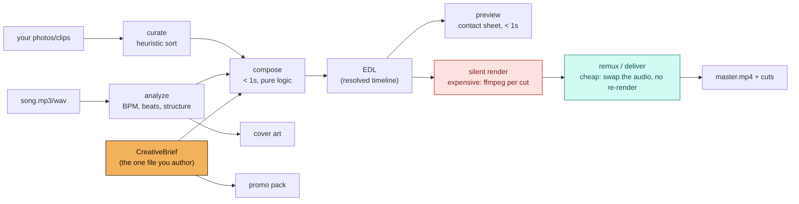

<h1 align="center">kaleidophone</h1>

<p align="center">
  <strong>Compose the edit, not the pixels.</strong><br>
  A song becomes its music video, the vertical cuts, the covers and the
  release copy — cut from your own footage, or drawn from nothing but the
  song — all derived from sources you can read.
</p>

<p align="center">
  <em>Claude directs. Deterministic code draws every pixel. Nothing is generated into a frame.</em>
</p>

<p align="center">
  <a href="https://github.com/sep-lab/kaleidophone/actions/workflows/ci.yml"></a>
  <a href="https://sep-lab.github.io/kaleidophone/"></a>
  <a href="LICENSE"></a>
  
  
  <a href="CONTRIBUTING.md"></a>
</p>

<table align="center">
  <tr>
    <td align="center"><a href="https://sep-lab.github.io/kaleidophone/pieces/hamechi-manzor-dare.html"><picture><source media="(prefers-reduced-motion: reduce)" srcset="https://sep-lab.github.io/kaleidophone/gallery/hamechi-manzor-dare.jpg"></picture></a></td>
    <td align="center"><a href="https://sep-lab.github.io/kaleidophone/pieces/minus.html"><picture><source media="(prefers-reduced-motion: reduce)" srcset="https://sep-lab.github.io/kaleidophone/gallery/minus.jpg"></picture></a></td>
    <td align="center"><a href="https://sep-lab.github.io/kaleidophone/pieces/same-as-you.html"><picture><source media="(prefers-reduced-motion: reduce)" srcset="https://sep-lab.github.io/kaleidophone/gallery/same-as-you.jpg"></picture></a></td>
    <td align="center"><a href="https://sep-lab.github.io/kaleidophone/pieces/should-i.html"><picture><source media="(prefers-reduced-motion: reduce)" srcset="https://sep-lab.github.io/kaleidophone/gallery/should-i.jpg"></picture></a></td>
  </tr>
  <tr>
    <td align="center"><sub><b>HAMECHI MANZOR DARE</b><br>paranoia, a swarm, masks, fire</sub></td>
    <td align="center"><sub><b>( - )</b><br>she is never drawn</sub></td>
    <td align="center"><sub><b>SAME AS YOU</b><br>one page, torn in two</sub></td>
    <td align="center"><sub><b>SHOULD I ?</b><br>36 frames, 36 snares, a 37th</sub></td>
  </tr>
</table>

<p align="center">
  <sub>Four songs by <a href="https://soundcloud.com/septheconcept">Sep The Concept</a>, each a single HTML file that plays live, renders its own film and draws its own covers.
  Clips rendered in CI from <b>synthetic</b> songs — <a href="https://sep-lab.github.io/kaleidophone/">open the gallery</a> to play them live.</sub>
</p>

<p align="center">
  <a href="#two-front-doors">Start here</a> ·
  <a href="#three-engines-one-contract">Three engines</a> ·
  <a href="#the-idea">The idea</a> ·
  <a href="#the-workflow-this-is-built-around">Draft → confirm → final</a> ·
  <a href="#the-vibe">The vibe</a> ·
  <a href="#made-with-this">Made with this</a> ·
  <a href="#cost-measured">Cost, measured</a> ·
  <a href="#documentation">Docs</a>
</p>

---

## What this is

You have a song. Maybe a folder of photos and clips too, maybe nothing but an
idea. You want a music video that moves with the song — not a slideshow with a
Ken Burns pan — plus the vertical cutdown, the covers, and the caption you have
to write before you can post any of it.

kaleidophone turns that into a release:

- a **video**, cut and coloured on the song's own structure — from your
  footage (graded per section, framed natively vertical), or **drawn**: a
  canvas piece whose every frame is a function of the song's envelope;
- **the cuts** — reel, stories, the full film — sliced frame-exactly from one
  render, with the master muxed under each and its loudness and true peak
  measured on the delivered file;
- **cover art**, from the same code that draws the video;
- a **release pack** — per-platform captions, chapters, timed comments, a
  posting order — with every timestamp derived from the edit.

Every one of those comes from a source you author and version — a YAML brief, a
frame program, a piece — never from a render you can't reproduce. That's not an
implementation detail, it's the whole architecture; see
[**the idea**](#the-idea).

## Two front doors

### I make music

Install it as a Claude Code plugin and talk to it:

```
/plugin marketplace add sep-lab/kaleidophone
/plugin install kaleidophone@kaleidophone
```

Then, in the folder with your song:

| | |
|---|---|
| `/kaleidophone:direct song.wav ./photos` | direct an edit of your own footage — Claude reads the song, asks what the audio can't answer, writes the brief, shows a contact sheet before anything expensive |
| `/kaleidophone:piece song.wav` | make a **drawn** piece: find the rule that generates the film, count the grid, start from the template |
| `/kaleidophone:deliver` | cut every deliverable from one silent render, mux and measure the audio |
| `/kaleidophone:master old.wav new.wav` | a new master arrived: re-mux, re-render some bars, or start again? |
| `/kaleidophone:release` | the whole arc, checking in at each expensive step |

Also `/kaleidophone:caption`, `/kaleidophone:cover`, `/kaleidophone:brief`. It is directing,
not generating — every frame is your material or code you can read.

#### Which model

| The work | Model | Why |
|---|---|---|
| `/kaleidophone:direct`, `/kaleidophone:piece`, `/kaleidophone:release`, and the review before a release | `best` — these three commands ask for it | hours-long jobs across many tools, where taste and code meet. `best` is Fable where your plan has it and Opus otherwise; without either, the command runs on your session's model |
| `/kaleidophone:caption`, `/kaleidophone:cover`, `/kaleidophone:brief`, `/kaleidophone:master` | the model you chose (Opus is the default on most plans) | short, judgement-heavy |
| `/kaleidophone:deliver`, re-renders, platform files | Sonnet is plenty (`/model sonnet`) | the tools do the work; the agent reads their reports |
| no tokens left | none | the engines are code — see [No tokens, no network, another agent](docs/PORTABILITY.md) |

Model aliases as Claude Code resolves them ([model config](https://code.claude.com/docs/en/model-config), checked 2026-10-01).

#### No tokens, or another agent

Everything but the taste runs without an AI: analysis, renders, every platform's
files and covers, and the factual half of the captions. `kaleidophone kit --llm
ollama:qwen3:8b` drafts the voice with a model on your own machine. Codex, Copilot,
Cursor, Gemini CLI and Jules read [AGENTS.md](AGENTS.md) and the skills
(`.agents/skills`). How, and what each can do:
[docs/PORTABILITY.md](docs/PORTABILITY.md).

### I write code

```bash
pip install "kaleidophone @ git+https://github.com/sep-lab/kaleidophone"   # needs a system ffmpeg
```

(Not on PyPI yet — the release workflow is ready and waiting for its trusted
publisher.) Then:

```bash
kaleidophone auto song.wav ./photos -o out/ --aspect 9:16 --preview-only   # footage -> a brief + contact sheet
kaleidophone envelope song.wav -o songpack.json                           # the song, analysed at 100 Hz
kaleidophone envelope song.wav --midi song.mid --stem vocals=vox.wav -o songpack.json   # ...or from the session
kaleidophone master-check old.wav new.wav                                 # did the new master move anything?
kaleidophone deliver delivery.yaml                                        # one silent render -> every platform, every ending
kaleidophone platforms                                                    # what each platform wants, with sources
kaleidophone kit --song song.wav --title "SONG" --lang en,fa --llm ollama:qwen3:8b   # captions, drafted locally
```

The canvas engine lives in [`canvas/`](canvas/README.md) (Node 20+):

```bash
cd canvas && npm ci && npx playwright-core install chromium
node tools/build.mjs --all && open dist/should-i.html                     # play a piece live
node tools/render.mjs same-as-you --song out/songs/same-as-you.songpack.json --t0 62.255 --dur 10 --out heart.mp4
```

Or the footage pipeline end to end, with nothing of your own:

```bash
git clone https://github.com/sep-lab/kaleidophone && cd kaleidophone
pip install -e ".[dev]" && bash examples/demo/run_demo.sh
```

That generates a synthetic song and procedural placeholder images — nothing
real, nothing personal — then runs the real pipeline end to end.
**Measured, one data point, not a benchmark suite:** 18.1 seconds for a
24-second/37-cut video at 640x360, on the machine named in
[Cost, measured](#cost-measured).

## Three engines, one contract

The first releases were cut from photographs; the recent ones have no footage
at all. Rather than one engine stretched over both, kaleidophone has three, and
they keep one contract ([ADR-0007](docs/decisions/0007-three-engines-one-contract.md)):

| Engine | Where | For |
|---|---|---|
| **Filter graphs** | `src/kaleidophone/render/` | your photos and clips: cut on the beat, graded per section, framed per shot — anything ffmpeg's filter language can say |
| **Frame programs** | `src/kaleidophone/frames/` | footage that needs per-pixel, stateful effects: a picture that forgets itself block by block, photocopies of photocopies, one colour that refuses to leave |
| **Canvas pieces** | [`canvas/`](canvas/README.md) | no footage — the picture is drawn: one self-contained HTML file per piece, live / render / cover modes |

The contract: the song is analysed once into an envelope pack
(`kaleidophone envelope`); every picture is a deterministic function of time and
that pack; the render is silent and segmented; the audio goes on last, where the
master lives (`kaleidophone deliver`). Every technique the releases taught is
written down, numbered, with where it lives in the code:
[docs/TECHNIQUES.md](docs/TECHNIQUES.md).

## The idea

**kaleidophone versions the source, not the render.** For footage that source
is a `CreativeBrief` — song, stations (colour-grade "looks"), sections (structure
+ effects), output settings: the one file a person authors by hand. The
edit-decision-list, the silent video, the muxed master, the teasers, the
thumbnails, the cover art: all derived, all rebuildable, none of them the source
of truth. See [ADR-0001](docs/decisions/0001-version-the-brief-not-the-render.md) —
the decision everything else follows from, the same way its sibling project
[Wit](https://github.com/sep-lab/Wit) versions the *recipe* of a DAW session
rather than its bounced audio. A canvas piece is the same idea taken further:
the piece *is* the source, and the film, the reel and the covers are renders of it.



The practical payoff is the workflow below.

## The workflow this is built around

The thing this project was explicitly built to support: **upload a draft
mp3, get a full video back, confirm the edit, then swap in the mastered
wave — without re-rendering the video.**

```bash
kaleidophone silent edl.json brief.yaml -o silent.mp4     # expensive: one+ ffmpeg call per cut
kaleidophone master-check draft.wav mastered_song.wav     # does the master still fit the edit?
kaleidophone remux   silent.mp4 mastered_song.wav -o master.mp4   # cheap: audio swap only, no re-render
```

`render_silent()` is the only step that touches every cut's colour grade and
effects; `mux_audio()` is one ffmpeg stream-copy on the video side plus one
audio re-encode. **Measured on this repo's own demo (37 cuts, 24s):**

| Resolution | `silent` | `remux` | speedup |
|---|---|---|---|
| 640x360 | 10.7s | 1.0s | ~11x |
| 1280x720 | 22.6s | 1.1s | ~21x |

(Both `remux` figures include ~0.8s of Python interpreter and librosa import
startup, which is most of what they measure — the ffmpeg work itself is a
fraction of a second.)

The swap is only safe if the new master still lines up with the edit — the
reference project learned that when a replacement master moved its biggest
moment ~5 s and the cheap swap would have desynced everything.
`kaleidophone master-check` answers that before you mux: the same grid and the
same material (**re-mux**), the same song starting earlier or later (**offset**:
it prints the `silent_start` to deliver at), some bars changed (**re-render
these bars**, naming the bands that changed), or a new grid. On a real release it proved a final master was a re-mux even though the
arrangement after the drop had changed
([#49](docs/TECHNIQUES.md#49-master-drop-in-check)).

## The vibe

The look isn't a preset you opt into — it's the default, because that's
the aesthetic this framework was built to produce fast: vintage, grainy,
a little psychedelic, loopish, radio-static energy. For footage, structure
comes from **stations** — named colour-grade "looks" any brief can point at
its own media:

| Station | Feel | Typically used for |
|---|---|---|
| `amber-room` | warm interiors, lamplight, intimate | an intro, a home-recorded feeling |
| `noir-crush` | black & white, crushed blacks, scanlines | street/documentary energy |
| `gold-hour` | golden hour, backlit, slow | a song's quiet or held moment |
| `fire-leak` | boosted colour, hot light-leak energy | the loudest, most saturated stretch |

Effects layer on top per section — `strobe`, `kaleidoscope`, `halation`,
`freeze_on_peak`, `zoom_breathe`, `grain`, `scanlines`, and more — several of
them conditional on the song's own structure (`strobe` only fires on cuts
containing a real onset). **Framing** is a creative field, not a computation:
`framing: {mode: crop, x: 700}` or `mode: window`. **Text** is `overlays`: timed
cards with real right-to-left shaping, so `کالیدوفون صدا را تصویر می‌کند` renders as
connected Persian letterforms.

For drawn pieces the vocabulary is different but the attitude isn't: find the
**rule** that generates the film — *she is never drawn*, *everything is seen
through his viewfinder*, *one page, torn in two* — and let the renderer obey it.
Count the grid before inventing anything: in SHOULD I ? there are exactly 36
snares from the drop to the hook, so the camera shoots one roll of film, and
runs out on the question.

What text is *for* is the opinionated part, and it's in the creative guide:
**describe nothing, inhabit something.** No dials, no frame counters, no labels
naming the section — unless the song is playing inside a machine and that
machine is a character. (A viewfinder's frame counter counts to 36 because the
camera does.) Full vocabulary: [docs/CREATIVE-GUIDE.md](docs/CREATIVE-GUIDE.md).

## Made with this

This isn't a framework looking for a user. It was extracted from a working
practice — the releases came first, the tool second, and each new song still
finds something it gets wrong. Twelve releases, built independently, kept
re-deriving the same architecture; the [case studies](docs/case-studies/README.md)
are the evidence:

| | Release | Engine | What it added |
|---|---|---|---|
| [→](docs/case-studies/love.md) | LOVE | filter graphs | the reference project: stations, the brief, draft→master |
| [→](docs/case-studies/loneliness.md) | Loneliness | ffmpeg | a track fitted bar by bar to someone else's finished film |
| [→](docs/case-studies/ahange-aroosi.md) | AHANGE AROOSI | frame program | found footage: a tracked watermark removed, one colour kept |
| [→](docs/case-studies/mikonamet.md) | MIKONAMET YEROZI KHOB FARAMOOSH | frame program | a video that forgets itself; resumable on-device renders |
| [→](docs/case-studies/hamechi-manzor-dare.md) | HAMECHI MANZOR DARE | canvas | the three-mode piece: live, render, cover |
| [→](docs/case-studies/minus.md) | ( - ) | canvas | the paper cut-out; Flash on twos; demo → master in one evening |
| [→](docs/case-studies/same-as-you.md) | SAME AS YOU | canvas | rig v2, the torn page, vector droste, frame-exact cuts |
| [→](docs/case-studies/should-i.md) | SHOULD I ? | canvas | the viewfinder; grid arithmetic; the master drop-in check |

The music: **[Sep The Concept on SoundCloud](https://soundcloud.com/septheconcept)**.
The videos: **[The Analog Guys in Digital Worlds on YouTube](https://www.youtube.com/@theanalogguysindigitalworlds)**.
None of that material — no song, stem, lyric, photo or frame — is in this
repository, and none of it can be: see [Your media stays yours](#your-media-stays-yours).

## Cost, measured

One data point per row, on the machine named — not a benchmark suite. Reproduce
the demo rows yourself: [CONTRIBUTING.md](CONTRIBUTING.md), "Ground rules for
claims".

**Footage (filter graphs), `examples/demo/`:** Apple M1 Pro (10 cores), macOS
15.7, ffmpeg 7.1, CPython 3.11.10 (x86_64 under Rosetta 2).

| | Resolution | Time | Size |
|---|---|---|---|
| Full `kaleidophone run` | 640x360 | 18.1s | 27.0 MB |
| Full `kaleidophone auto` (42 photos, 5 sections) | 1280x720 | 39.4s | 182.3 MB |
| `silent` render alone | 640x360 -> 1280x720 | 10.7s -> 22.6s | 26.7 MB -> 104.9 MB |
| `remux` alone (either resolution) | — | ~1.0s | — |

**Drawn and frame-program releases, as rendered for real** (from the case
studies; 1080×1920):

| | Where | Speed |
|---|---|---|
| SAME AS YOU, full film (3,324 frames) | 2 cloud cores, 2 workers | 6.1 fps |
| ( - ), full film at 12 drawings/s | cloud | ~8.5 fps |
| HAMECHI MANZOR DARE, JPEG vs PNG capture | cloud | ~9.5 vs ~4 fps |
| SHOULD I ?, the darkroom section | 2 cloud cores | ~3 fps per worker |
| MIKONAMET, frame program | 4-core ARM VM | ~8.7 fps per worker, ~13 fps with 3 |

Grain and noise-heavy effects resist h264 compression — a real tradeoff between
the vintage look and file size, not a bug. Beat tracking is a heuristic first
pass, and synthetic material flatters it (measured; none of this is on real
songs). On the demo's synthetic click track, programmed at exactly 120.0 BPM,
librosa returns **117.5**. `kaleidophone envelope` returns click tracks at 60,
93.5, 120 and 174 BPM within 0.05 BPM (its tests), and on synthetic grooves
made for the 0.3 review — 80 to 140 BPM, a 62% swing, a 30 s beatless intro —
every grid beat landed within 10 ms of the programmed one. It fails on the
octave and on a tempo that moves: a 70 BPM ballad of 8th-note piano comes back
at 140 and a 174 BPM drum-and-bass two-step at 87 (both pinned in
`tests/test_envelope.py`), and a click track gliding from 88 to 92 BPM
(`tempo_ramp` there) leaves 68 of its 88 beats more than half a 24 fps frame
off the best single grid. So the song pack says what it is unsure of — the
other octave and its score, how far the music sits from the grid in every 8
bars, how sure bar 1 is — and `--bpm-range` and `--downbeat` override it. See
[docs/ARCHITECTURE.md](docs/ARCHITECTURE.md).

## Why deterministic code, not AI video generation

Real photos and clips assembled deterministically, or pictures drawn by code
you can read — not a per-frame generative model. Three reasons, in order: cost
(per-frame generation for a multi-minute video is expensive and slow),
reproducibility (the same source renders the same frames every time — the whole
cheap-resync workflow depends on it), and creative control (a station's grade is
a handful of legible numbers; a piece's rule is a few lines you can change, not
a prompt you reverse-engineer). See
[ADR-0002](docs/decisions/0002-deterministic-edit-engine.md) and
[ADR-0007](docs/decisions/0007-three-engines-one-contract.md).

## Your media stays yours

kaleidophone is local-first and never transmits your photos, video, or audio
anywhere — everything runs on your own machine through your own `ffmpeg` (and,
for canvas pieces, your own browser: a piece makes no network request at all).
This repository itself is built so that **no real media, no personal file path
and no real song data can be committed to it**, enforced in CI, not just by
convention:

- `.gitignore` blocklists every common audio/video/image extension.
- `check_no_media.sh` refuses them again at commit time, plus an
  oversized-file ceiling for formats nobody thought to blocklist yet.
- `check_no_personal_paths.py` refuses absolute paths into a real home
  directory (`/Users/you/...`, `/home/you/...`) anywhere in a tracked file.
- Every example brief ships placeholder paths and no real collaborator.
- A real **song pack** — the envelopes and vocal onsets of an unreleased master
  — is private like the audio. Pieces here run on **synthetic twins**: the
  song's tempo, first downbeat and rounded per-section levels, every hit
  generated. `check_no_real_songpacks.py` refuses any tracked pack not marked
  synthetic.
- The **gallery** is rendered in CI and published with GitHub Pages; not one
  image or clip is in git.

See [ADR-0003](docs/decisions/0003-public-framework-private-assets.md),
[ADR-0007](docs/decisions/0007-three-engines-one-contract.md),
[AGENTS.md](AGENTS.md), and [SECURITY.md](SECURITY.md).

## Repo map

```
src/kaleidophone/
  audio/        analyze a song; the envelope pack (and MIDI + stems in); the master drop-in check
  assets/       station presets + heuristic photo/clip curation
  timeline/     CreativeBrief schema, EDL, compose(), zero-config auto mode
  render/       ffmpeg pipeline (silent/remux split, effects, preview, teasers), deliver, platforms
  frames/       frame programs: per-pixel, stateful effects; resumable workers
  cover/        procedural cover art from the song's own energy envelope; every platform's size
  overlay/      timed text cards, shaped right-to-left, bundled OFL fonts
  promo/ release/   chapters, captions, the per-platform copy pack
  cli.py        the `kaleidophone` command
canvas/         the canvas engine (Node): pieces/, lib/, tools/, test/ -- see canvas/README.md
skills/ commands/   the Claude Code plugin: one skill per stage (also at .agents/skills), slash commands
examples/
  demo/         fully synthetic end-to-end demo (run_demo.sh)
  love/         a hand-authored brief matching the reference project
docs/
  TECHNIQUES.md every field-tested technique, numbered, with where it lives
  PLATFORMS.md  every platform's spec, generated from render/platforms.py
  PORTABILITY.md  no tokens, no network, another agent
  decisions/    ADRs -- the design, and what would overturn each one
  case-studies/ the real releases this framework generalizes from
tests/          unit tests; synthetic fixtures only; ffmpeg argv asserted, never run
.github/workflows/  CI (lint, tests, guardrails, demo, canvas) and the Pages gallery
```

## Documentation

- **[AGENTS.md](AGENTS.md)** — the canonical brief for anyone (or any agent)
  working on this repo. Start here if you're contributing code.
- **[docs/TECHNIQUES.md](docs/TECHNIQUES.md)** — every technique the real releases
  taught, numbered, each with where it came from and where it lives.
- **[docs/PLATFORMS.md](docs/PLATFORMS.md)** — what every platform wants (size,
  length, audio, file limit, safe area, loudness), sourced and dated.
- **[docs/PORTABILITY.md](docs/PORTABILITY.md)** — no tokens, no network, or
  another agent: what still runs, and how.
- **[docs/NIGHT-CLOCK.md](docs/NIGHT-CLOCK.md)** — how long the last six
  releases took to land, from their folders' file times (measured, rough): the
  baseline release-night work is measured against.
- **[canvas/README.md](canvas/README.md)** — the canvas engine: the piece
  contract, song packs, rendering, starting a new piece.
- **[docs/ARCHITECTURE.md](docs/ARCHITECTURE.md)** — the pipeline in detail, the
  three engines, the measured cost table, the render-design tradeoffs.
- **[docs/BENCHMARKS.md](docs/BENCHMARKS.md)** — `kaleidophone doctor`, the
  benchmark suites, and how a speed number earns the word *measured*.
- **[docs/decisions/](docs/decisions/)** — the ADRs, each with what would overturn it. Read
  [0001](docs/decisions/0001-version-the-brief-not-the-render.md),
  [0002](docs/decisions/0002-deterministic-edit-engine.md) and
  [0007](docs/decisions/0007-three-engines-one-contract.md) first.
- **[docs/CREATIVE-GUIDE.md](docs/CREATIVE-GUIDE.md)** — the visual vocabulary:
  stations, effects, structure, and the rules the drawn pieces follow.
- **[docs/CONFIG-SCHEMA.md](docs/CONFIG-SCHEMA.md)** — the `CreativeBrief`, the
  delivery sheet and the song pack, field by field.
- **[docs/case-studies/](docs/case-studies/README.md)** — the releases.
- **[docs/ROADMAP.md](docs/ROADMAP.md)** and **[docs/PRIOR-ART.md](docs/PRIOR-ART.md)**.

## Status

**v0.4 — the session, every platform, every ending.** Every claim above was
measured on the machine or the release it names; see [CHANGELOG.md](CHANGELOG.md)
for what's built, including the real bugs found and fixed rather than documented
as known issues. Before each release since 0.3, the work has been reviewed from
three seats — a musician's, an art director's and a staff engineer's — and it
ships with their findings fixed and measured. What's next, engine by engine:
[ROADMAP.md](docs/ROADMAP.md), "The next engines and features".

What's genuinely still open, in the order it hurts:

- **Filter-graph renders can't be stream-cut yet.** `kaleidophone silent`
  re-encodes in its final pass and can't force keyframes, so `deliver` cuts
  canvas and frame-program renders losslessly but a footage render only after a
  re-encode.
- **Cover art for footage is procedural, not designed.** The typographic
  templates — a burned-in subtitle, a two-ink screen print, a negative — are
  [designed and not built](https://github.com/sep-lab/kaleidophone/issues/21).
  (Drawn pieces draw their own covers.)
- **Proven on one artist's work.** Twelve releases, one practice. A case study
  run by someone else would do more to prove it travels than anything else on
  the roadmap — see [CONTRIBUTING.md](CONTRIBUTING.md).
- **`kaleidophone auto` lags the hand-authored path**
  ([#45](https://github.com/sep-lab/kaleidophone/issues/45),
  [#54](https://github.com/sep-lab/kaleidophone/issues/54)).

## Where to start contributing

Full guide: **[CONTRIBUTING.md](CONTRIBUTING.md)**. The short version:

| | Task |
|---|---|
| 🟢 | A canvas piece of your own, from `canvas/pieces/template` — with a synthetic twin, it can live in the repo |
| 🟢 | More effects — `render/effects.py` is small composable filter-string builders; `frames/effects.py` is numpy |
| 🟢 | A case study from your own release — the single highest-value contribution on the roadmap |
| 🟡 | Forced keyframes in `kaleidophone silent`, so footage renders can be cut losslessly |
| 🟡 | Smarter auto-sectioning — `timeline/autobrief.py` falls back to even slicing more often than it should |
| 🔴 | Adversarial review of the privacy guardrails — if you can get a real path, a media file or a real song pack past CI, that's exactly the report this project wants |

## License

[Apache License 2.0](LICENSE) · [Code of Conduct](CODE_OF_CONDUCT.md) · [Security](SECURITY.md)
