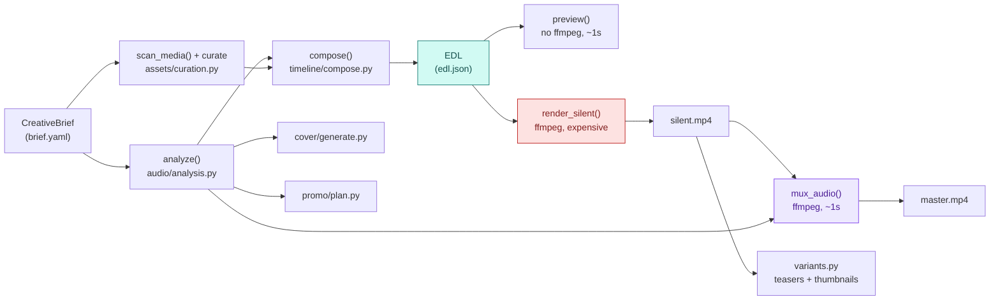

# Architecture

How kaleidophone turns a brief into a video, cover, and promo pack — and why the
pipeline is split where it's split.

---

## 1. The pipeline

Everything downstream of the brief is derived and rebuildable — see
[ADR-0001](decisions/0001-version-the-brief-not-the-render.md). The two
colored stages are the ones worth knowing the cost of: `render_silent`
(red) is the expensive one; `mux_audio` (purple) is the cheap one that
reuses its output.

## 2. Data flow, in order

1. **`CreativeBrief`** (`timeline/schema.py`, pydantic) — the one
   hand-authored file. Song, stations (a look), sections (a stretch of the
   song, a station, a cut density, an effect list), output config.
   `kaleidophone auto` can generate one; either way it's the same schema.

2. **`AudioAnalysis`** (`audio/analysis.py`, librosa) — BPM, beat grid,
   onset times/strength, RMS envelope, plus two heuristics derived from RMS
   and onset strength: quiet passages ("the hush") and energy jumps ("the
   switch"). Deterministic given the same audio file.

3. **Curated assets** (`assets/curation.py`) — each station's `media_dir`
   scanned and (for `kaleidophone auto`/`kaleidophone curate`) scored against the
   station's palette. A `dict[station_name, list[MediaAsset]]`.

4. **`EDL`** (`timeline/model.py` + `compose()`) — the resolved,
   frame-accurate timeline: every cut's start/end, which asset fills it,
   which effects fire. `compose()` is a pure function of
   `(brief, analysis, station_assets)` and a per-section seed, so the same
   inputs always produce the same edit — see
   [ADR-0001](decisions/0001-version-the-brief-not-the-render.md) on why
   that matters for re-renders.

5. **Render** (`render/ffmpeg_pipeline.py`) — see "Why segment-then-concat"
   below.

6. **Variants, cover, promo** — `render/variants.py` (teasers/thumbnails
   from the rendered master), `cover/generate.py` (a procedural cover from
   the same `AudioAnalysis`, independent of the video render), `promo/plan.py`
   (chapters/caption/teaser-cadence markdown from the brief + analysis).
   None of these three depend on each other; all three can run in any order
   once `AudioAnalysis` exists.

## 3. Why segment-then-concat, not one filter_complex graph

`render_silent()` renders every `Cut` as its own short ffmpeg call (scale,
crop, color grade, effects), writes it to a temp file, then concatenates all
of them and muxes audio on separately. The alternative — one giant
`filter_complex` graph for the whole video — would avoid re-encoding at
concat boundaries and could well be faster.

We didn't build that first version because a broken cut, in the segment
model, is a five-second re-render with an ffmpeg error that names the one
command that failed. In one filter-graph-for-everything, it's a few-hundred-
line graph to bisect. For a project whose whole reason to exist is being
fast to iterate on, "fast to debug when it breaks" outweighed "marginally
faster when it doesn't," at least for v0.1. A single-pass filter_complex
renderer is tracked in [ROADMAP.md](ROADMAP.md) as a real, worthwhile
optimization once the segment model has enough real usage to know which
effects are common enough to be worth optimizing for.

## 4. Effects: linear vs. graph filters

ffmpeg's filter language has two shapes, and `render/effects.py` splits
along that line:

| | Shape | Examples | Applied via |
|---|---|---|---|
| **Linear** | single input, single output | color grade, strobe, grain, scanlines, vignette, zoom | one comma-joined `-vf` chain |
| **Graph** | splits the frame into multiple named pads | kaleidoscope, halation | its own `-filter_complex` pass, chained after the linear pass |

`ffmpeg_pipeline._render_segment()` builds the linear chain once, runs it,
then runs one additional ffmpeg pass per graph effect on the previous
stage's output. N graph effects on one cut means N+1 total ffmpeg calls for
that segment — rare in practice, since most sections use zero or one graph
effect.

## 5. Frame-accurate cuts

`compose()` snaps every cut boundary onto the `1/fps` grid
(`timeline/compose.py::snap_to_frame`) before it ever reaches the renderer,
and `render_silent()` bounds each segment with `-frames:v N` rather than a
duration in seconds. Both halves are load-bearing for audio sync, and the
reason is worth stating plainly because it is not obvious:

**`render_silent()` concatenates segments back to back, so a cut's real
position on the timeline is the running total of the durations before it —
not its own `start`.** ffmpeg can only emit whole frames, so it truncates
any fractional one. An un-snapped beat grid therefore loses part of a frame
on *every* cut, always in the same direction, and the error accumulates.

**Measured** on a 300s/129 BPM synthetic track (the tempo of the reference
case study), rendering 640 cuts at 320x180, before and after the snapping:

| | Cuts on the frame grid | Final drift | Rendered length vs. 300s audio |
|---|---|---|---|
| Before | 0 / 640 | **-3.25s** (78 frames) | 296.75s |
| After | 640 / 640 | **0.00s** | 300.00s |

A cut of 0.464399s is 11.1456 frames; ffmpeg emitted 11 and dropped the
rest, 640 times over. At the ~11-minute length of the reference case study
that is roughly 7 seconds of drift — **inferred** by linear extrapolation
from the measurement above, not measured directly. The regression tests in
`tests/test_compose.py` pin the grid property directly rather than the
symptom.

Two related guards live alongside it: `EDL.__post_init__` refuses a timeline
with gaps or a first cut that doesn't start at 0.0 (under concatenation those
don't render as gaps, they slide the whole edit off the audio), and
`mux_audio()` warns before `-shortest` silently truncates a stream.

### When the beat tracker returns nothing

librosa locks onto the strongest rhythmic region of a track and can return
*no* beats for a quiet passage — on this repo's own demo song it finds none
in the first 11 of 24 seconds. A section with no beats inside it falls back
to a grid synthesized from the detected BPM
(`timeline/compose.py::_tempo_grid`) and prints a note to stderr. The
alternative, which is what this used to do, was to silently emit one cut
spanning the whole section: a brief asking for `every_2_beats` got a single
8-second still and no explanation.

## 6. Cost, measured

From `examples/demo/` (24s synthetic song, 37 cuts, hand-authored 3-section
brief unless noted). Not a benchmark suite — one data point, on one
machine, cited here as **measured**, not a general performance claim; see
CONTRIBUTING.md, "Ground rules for claims" for how to reproduce these.

**Measured on:** Apple M1 Pro (10 cores), macOS 15.7, ffmpeg 7.1, CPython
3.11.10 — an *x86_64* interpreter under Rosetta 2 rather than a native
arm64 build, so a native run should be faster. Named because "one machine"
only means something if you know which one.

| Stage | Resolution | Time |
|---|---|---|
| Full `kaleidophone run` (analyze -> render -> promo) | 640x360 | 18.1s |
| Full `kaleidophone auto` (default 720p, 42 photos, 5 sections) | 1280x720 | 39.4s |
| `render_silent` alone | 640x360 | 10.7s |
| `mux_audio` alone (re-sync audio, no re-render) | 640x360 | 1.0s |
| `render_silent` alone | 1280x720 | 22.6s |
| `mux_audio` alone (re-sync audio, no re-render) | 1280x720 | 1.1s |

Both `mux_audio` figures are dominated by ~0.8s of Python interpreter and
librosa import startup; the ffmpeg work itself is a fraction of a second.
That is worth knowing before optimizing the wrong half. `mux_audio` is
otherwise a near-fixed cost (a stream-copy plus one audio re-encode) that
barely moves with resolution, while `render_silent` scales with pixel
count — which is why the remux speedup isn't a single constant: ~11x at
640x360 and ~21x at 1280x720 end-to-end here, and wider at higher
resolutions. See [ADR-0001](decisions/0001-version-the-brief-not-the-render.md).

Grain/noise-heavy effects measurably inflate output size, and that scales
with resolution too: the same 37-cut EDL rendered at 640x360 is 26.7MB;
rendered at 1280x720 (identical cuts and effects, resolution changed only)
it's 104.9MB — a 3.9x size increase for a 4x pixel-count increase, since
noise resists h264 compression almost regardless of scale. The 720p `auto`
run above (more sections, more cuts, more photos) is 182.3MB for the same 24
seconds. This is a real tradeoff between the "vintage, grainy" look this
project's whole aesthetic calls for and output file size, not a bug. If
size matters more than grain for a given project, turn down
`StationConfig.grain` and drop the `grain` effect from section effect
lists. See CHANGELOG.md's "Known limitations".

BPM detection on the demo's synthetic click track (programmed at exactly
120.0 BPM) comes back as **117.5** — a reminder that beat tracking is a
heuristic first pass even on a clean signal, not just on a real
performance; see `SongConfig.bpm` to override it and the
`kaleidophone-audio-analysis` skill.

## 7. Why 1280x720 by default, not higher

The project this framework generalizes from was delivered at 1280x720 —
see `docs/case-studies/love.md`. Combined with the measured cost above and
this project's own stated priority ("efficient token... minimal and fast,"
not maximum resolution), `OutputConfig.resolution` defaults to 720p rather
than 1080p or 4K. Nothing stops a brief from requesting higher — it's a
plain tuple in the schema — but it isn't the default, and doubling
resolution roughly quadruples pixel count and render time for a look this
project's whole aesthetic (grain, scanlines, vignette) doesn't especially
reward.
